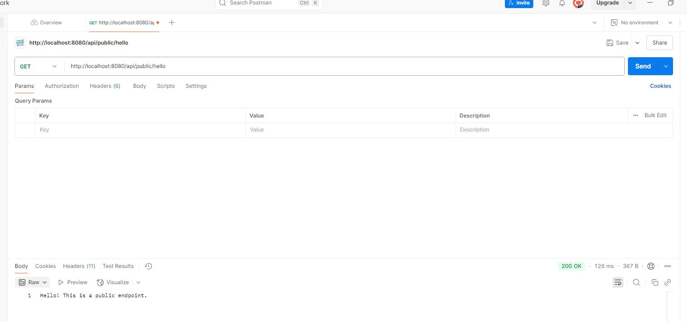
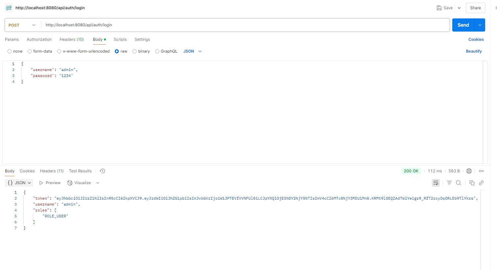
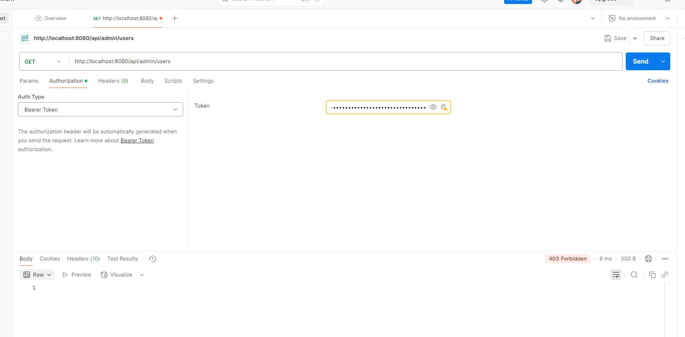

# Spring Security Lab

En este lab vamos a crear una aplicación Spring Boot con Spring Security y JWT. Aplicaremos los conceptos de autenticación y autorización que hemos aprendido en clase.

## Objetivo

Crear una API REST segura con Spring Boot que implemente:
- Autenticación con JWT
- Autorización basada en roles
- Rutas públicas y protegidas

## Pasos a Seguir

### 1. Preparación del Proyecto

1. Fork de este repositorio y clona tu fork en tu máquina local.
2. Accede a [Spring Initializr](https://start.spring.io/) para crear la app con las dependencias que indica la lección.
3. Descarga el proyecto y descomprime todos los archivos **directamente en la raíz del repositorio**.

   **IMPORTANTE**: NO deberán aparecer subcarpetas con el nombre de la app, sino que todos los ficheros deben estar en la raíz del repositorio.

### 2. Implementación

1. Sigue la lección de hoy para implementar paso a paso:
   - Modelo de usuario y roles
   - Repositorios
   - Servicio de autenticación y generación de tokens JWT
   - Filtros de seguridad
   - Controladores con diferentes niveles de acceso

2. Asegúrate de crear al menos:
   - Una ruta pública que no requiera autenticación
   - Una ruta para login que devuelva un token JWT
   - Una ruta que requiera autenticación con cualquier rol
   - Una ruta que requiera un rol específico (por ejemplo, ADMIN)

### 3. Pruebas

Realiza pruebas con Postman para verificar que la seguridad funciona correctamente. Debes adjuntar capturas de pantalla de las siguientes pruebas:

1. Acceso exitoso a una ruta pública que no requiere autenticación

2. Solicitud de login exitosa que devuelve el token JWT.

3. Intento de acceso a una ruta protegida sin token (debe devolver código 401).

4. Acceso exitoso a la misma ruta protegida incluyendo el token JWT (debe devolver código 200).

5. Intento de acceso a una ruta que requiere un rol específico sin tener dicho rol (debe devolver código 403).

## Entrega

- Asegúrate de que tu código está completo y funcional
- Incluye las capturas de pantalla en una carpeta `screenshots` en la raíz del repositorio
- Haz commit y push de tus cambios a tu fork
- Crea un Pull Request a este repositorio original para que podamos revisar tu trabajo.
- Entrega el enlace a tu Pull Request en el portal.